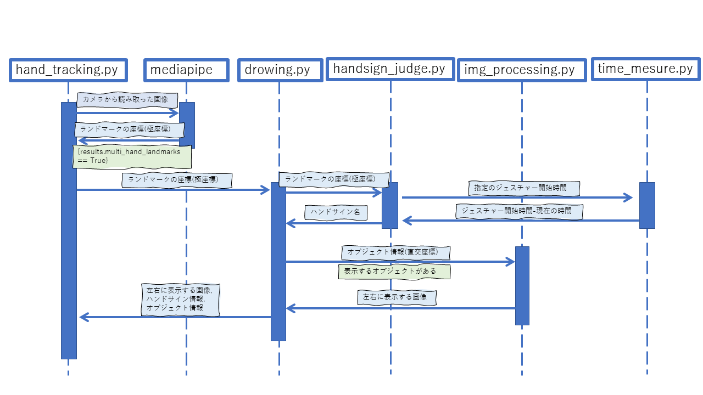
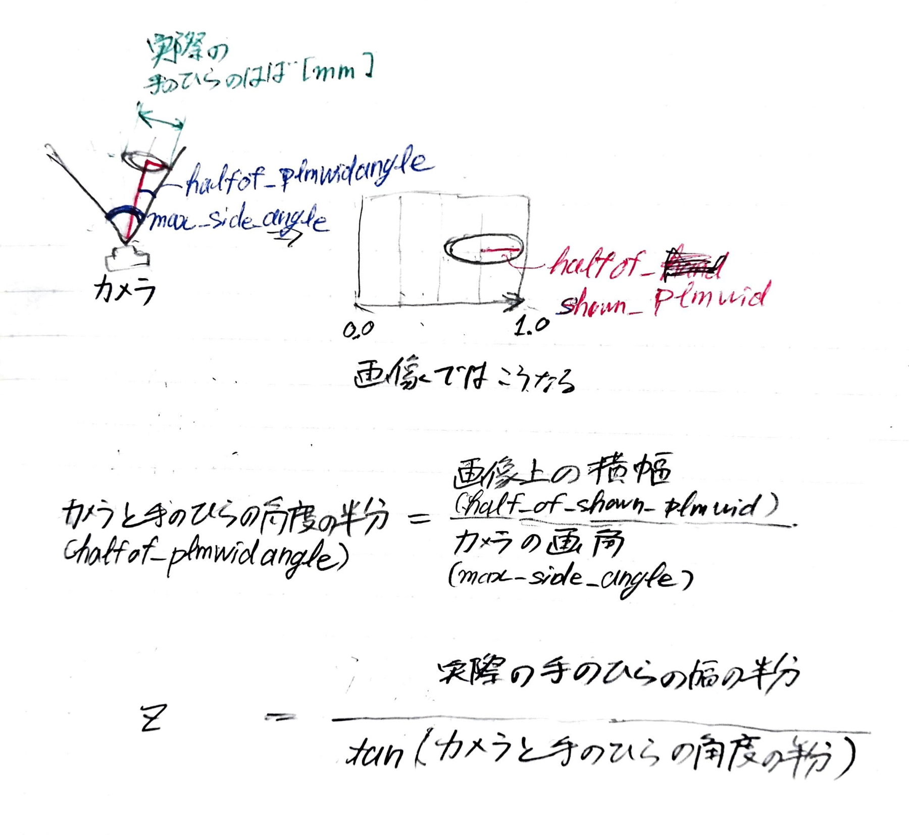
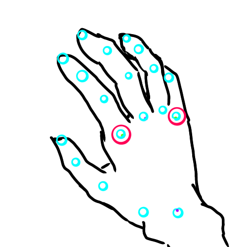
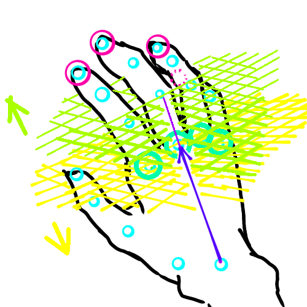
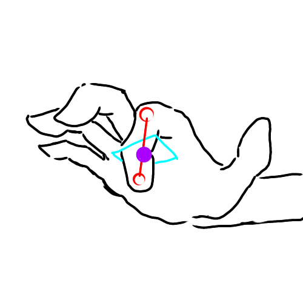

# SmartGlass202101
## 1. 概要
SmartGlass2020の改良版になります。 
こちらのmediapipe handsを使用し、手の座標を読み取っています。 
https://google.github.io/mediapipe/solutions/hands

## 2. 表示方法
mediapipeから返された極座標の値をdrowing.pyに渡します。 
drowing.pyからhandsign_judge.pyを呼び出しジェスチャーを判断します。 
必要であれば直交座標のオブジェクトを呼び出します。オブジェクトの各値をimg_processing.pyで左右の目に合わせてずらし、極座標で返します。 

## 3. handsign_judge.py
### 3.1. 手のひらの距離の測り方
handsign_judge.pyのメソッドpalm_dipthを使用しています。 

### 3.2. ハンドサインの求め方
以下の要素から、ハンドサインを求める

#### 3.2.1. 手のひらの向きの判断
・人差し指の付け根から小指の付け根までのx座標の距離が、手首から中指の付け根までの距離の1/3以下なら、「横向き(side ways palm)」  
・「横向き」ではなく、人差し指の付け根のほうが左にあるなら、「裏(reverse)」  
・「横向き」ではなく、人差し指の付け根のほうが右にあるなら、「表(overse)」  

#### 3.2.2. 指の曲げ伸ばしの判断
手首から中指の付け根までのベクトルvに垂直で、中指の付け根を通る面S と
面Sを、ベクトルv方向に手のひらの長さの1/3ずらした、面S'を考える。 
・指先が面Sより手首側なら「-1」 
・指先が面SとS'の間なら「0」 
・指先が面Sより外側(中指の付け根側)なら「1」 
とする。 

### 3.3. キーボードの入力
キーボードの面と指の交点が、範囲内にあるかどうかを判断して、入力しています。 

 
第二間接の座標(x0,y0,z0)から指先の座標(x1,y1,z1)までのベクトルv=(a,b,c)は  
&space;%5C)
...(key-1)
 
https://latex.codecogs.com/png.latex?\&space;v&space;=&space;\left(&space;\begin{array}{ccc}&space;x1&space;-&space;x0&space;\\&space;y1&space;-&space;y0&space;\\&space;z1&space;-&space;z0&space;\end{array}&space;\right)&space;\
 
 
よって以下の方程式が成り立つ  

...(key-2)
 
https://latex.codecogs.com/png.latex?\&space;\frac{x-x0}{a}&space;=&space;\frac{y-y0}{b}&space;=&space;\frac{z-z0}{c}&space;\
 
 
ここでキーボードの平面の式は 

...(key-3)
 
https://latex.codecogs.com/gif.latex?\&space;a_v&space;x&plus;&space;b_v&space;y&plus;&space;c_v&space;z&space;=&space;d_v&space;\
 
 
式key-2、key-3より 

...(key-4)
 
https://latex.codecogs.com/gif.latex?\&space;\begin{displaymath}&space;\left\{&space;\begin{array}{l}&space;bx&space;-&space;ay&space;&plus;&space;0&space;=&space;bx_0&space;-&space;ay_0&space;\\&space;cx&space;&plus;&space;0&space;-&space;az&space;=&space;cx_0&space;-&space;az_0&space;\\&space;a_v&space;x&space;&plus;&space;b_v&space;y&space;&plus;&space;c_v&space;z&space;=&space;d_v&space;\end{array}&space;\right.&space;\end{displaymath}&space;\
 
 
行列にすると 
&space;%5Cend%7Bdisplaymath%7D&space;%5Codot&space;%5Cbegin%7Bdisplaymath%7D&space;%5Cleft%5C(&space;%5Cbegin%7Barray%7D%7Bccc%7D&space;x&space;%5C%5C&space;y&space;%5C%5C&space;z&space;%5Cend%7Barray%7D&space;%5Cright%5C)&space;%5Cend%7Bdisplaymath%7D&space;=&space;%5Cbegin%7Bdisplaymath%7D&space;%5Cleft%5C(&space;%5Cbegin%7Barray%7D%7Bccc%7D&space;bx_0&space;-&space;ay_0&space;%5C%5C&space;cx_0&space;-&space;az_0&space;%5C%5C&space;d_v&space;%5Cend%7Barray%7D&space;%5Cright%5C)&space;%5Cend%7Bdisplaymath%7D&space;%5C)
...(key-5)
 
https://latex.codecogs.com/gif.latex?\&space;\begin{displaymath}&space;\left\(&space;\begin{array}{ccc}&space;b&space;&&space;-a&space;&&space;0&space;\\&space;c&space;&&space;0&space;&&space;-az&space;\\&space;a_v&space;&&space;b_v&space;&&space;c_v&space;\end{array}&space;\right\)&space;\end{displaymath}&space;\odot&space;\begin{displaymath}&space;\left\(&space;\begin{array}{ccc}&space;x&space;\\&space;y&space;\\&space;z&space;\end{array}&space;\right\)&space;\end{displaymath}&space;=&space;\begin{displaymath}&space;\left\(&space;\begin{array}{ccc}&space;bx_0&space;-&space;ay_0&space;\\&space;cx_0&space;-&space;az_0&space;\\&space;d_v&space;\end{array}&space;\right\)&space;\end{displaymath}&space;\
 
 
両辺に右から逆行列を掛けて、xyzを求める。 
&space;%5Cend%7Bdisplaymath%7D&space;=&space;%5Cbegin%7Bdisplaymath%7D&space;%5Cleft%5C(&space;%5Cbegin%7Barray%7D%7Bccc%7D&space;b&space;&&space;-a&space;&&space;0&space;%5C%5C&space;c&space;&&space;0&space;&&space;-az&space;%5C%5C&space;a_v&space;&&space;b_v&space;&&space;c_v&space;%5Cend%7Barray%7D&space;%5Cright%5C)&space;%5E%7B-1%7D&space;%5Cend%7Bdisplaymath%7D&space;%5Codot&space;%5Cbegin%7Bdisplaymath%7D&space;%5Cleft%5C(&space;%5Cbegin%7Barray%7D%7Bccc%7D&space;bx_0&space;-&space;ay_0&space;%5C%5C&space;cx_0&space;-&space;az_0&space;%5C%5C&space;d_v&space;%5Cend%7Barray%7D&space;%5Cright%5C)&space;%5Cend%7Bdisplaymath%7D&space;%5C)
...(key-6)
 
https://latex.codecogs.com/gif.latex?\&space;\begin{displaymath}&space;\left\(&space;\begin{array}{ccc}&space;x&space;\\&space;y&space;\\&space;z&space;\end{array}&space;\right\)&space;\end{displaymath}&space;=&space;\begin{displaymath}&space;\left\(&space;\begin{array}{ccc}&space;b&space;&&space;-a&space;&&space;0&space;\\&space;c&space;&&space;0&space;&&space;-az&space;\\&space;a_v&space;&&space;b_v&space;&&space;c_v&space;\end{array}&space;\right\)&space;^{-1}&space;\end{displaymath}&space;\odot&space;\begin{displaymath}&space;\left\(&space;\begin{array}{ccc}&space;bx_0&space;-&space;ay_0&space;\\&space;cx_0&space;-&space;az_0&space;\\&space;d_v&space;\end{array}&space;\right\)&space;\end{displaymath}&space;\
